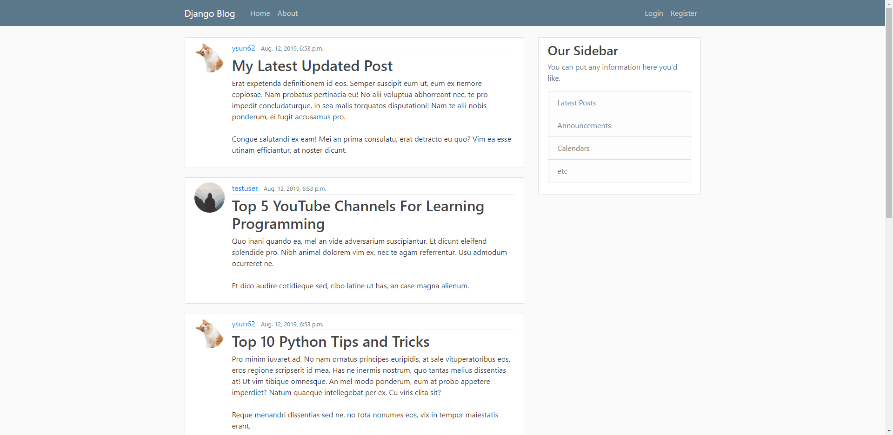
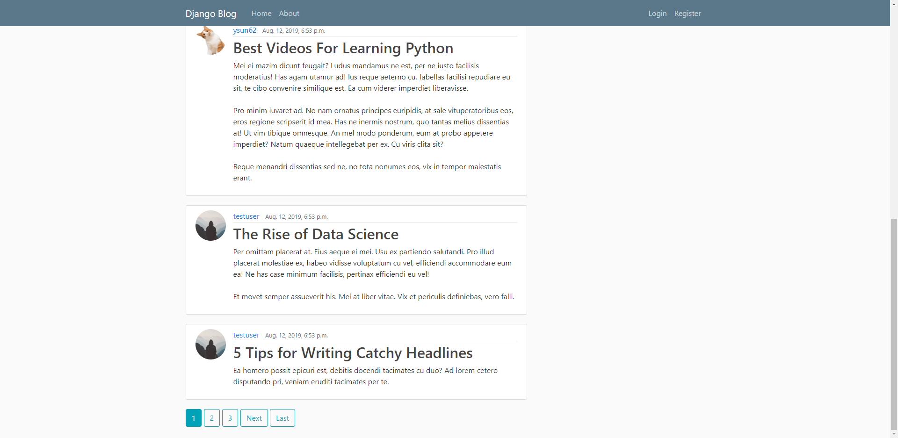

# Django-Blog

Available at https://djangoprojectblogapp.herokuapp.com/

A back-end blog implemented with Django, which allows the user to:

    (1) create/read/update/delete blogs
    (2) create/read/update/delete user profile

Here are some screenshots of the home page:

